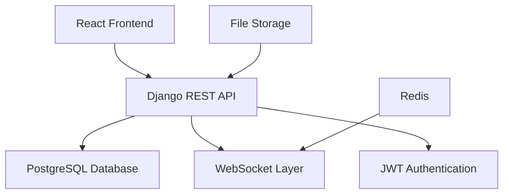

# HealthyPhysio Codebase Analysis

## 1. System Architecture Overview

HealthyPhysio is a comprehensive healthcare management platform built with a modern full-stack architecture:

### Architecture Pattern
- **Backend**: Django REST Framework with PostgreSQL database
- **Frontend**: React.js with React Router for SPA functionality
- **Authentication**: JWT-based authentication with role-based access control
- **Real-time Communication**: WebSocket support via Django Channels
- **Database**: PostgreSQL with complex relational schema
- **API Design**: RESTful API with consistent endpoint structure

### High-Level Architecture


## 2. Backend Architecture Analysis

### Django Project Structure
The backend is organized into 12 specialized Django apps:

#### Core Apps
1. **users** - Custom user model and authentication
2. **scheduling** - Appointment and session management
3. **treatment_plans** - Treatment planning and versioning
4. **assessments** - Patient assessments and evaluations

#### Management Apps
5. **attendance** - Therapist attendance tracking
6. **equipment** - Equipment allocation and management
7. **earnings** - Financial tracking and payments
8. **areas** - Geographical area management

#### System Apps
9. **audit_logs** - HIPAA-compliant audit logging
10. **notifications** - User notification system
11. **websocket** - Real-time communication
12. **visits** - Visit tracking and reports

### Custom User Model
- **Base Model**: AbstractUser with role-based permissions
- **Roles**: Admin, Therapist, Patient, Doctor
- **Authentication**: Email/phone/username login support
- **Profile Management**: Separate profile models for each role

### Key Backend Features
- **Role-based Access Control**: Granular permissions per user type
- **Audit Logging**: Complete HIPAA-compliant activity tracking
- **Session Management**: Complex appointment and session workflow
- **Treatment Planning**: Versioned treatment plans with approval workflow
- **Equipment Tracking**: Allocation and maintenance management
- **Financial Management**: Earnings calculation and payment scheduling

## 3. Frontend Architecture Analysis

### React Application Structure
- **Framework**: React 19.1.0 with functional components and hooks
- **Routing**: React Router DOM 7.5.0 with protected routes
- **State Management**: Context API for authentication
- **Styling**: Tailwind CSS 3.3.3 with Material-UI components
- **HTTP Client**: Axios with interceptors for authentication

### Route Structure
#### Public Routes
- `/` - Landing page
- `/login` - Authentication
- `/register` - User registration

#### Protected Routes by Role
**Admin Routes:**
- `/admin/appointments` - Appointment management
- `/admin/equipment` - Equipment oversight
- `/admin/attendance` - Attendance monitoring
- `/admin/financial-dashboard` - Financial overview
- `/admin/audit-dashboard` - Audit log review

**Therapist Routes:**
- `/therapist/dashboard` - Therapist overview
- `/therapist/patients` - Patient management
- `/therapist/treatment-plans` - Treatment planning
- `/therapist/earnings` - Earnings tracking
- `/therapist/reports` - Session reports

**Patient/Doctor Routes:**
- `/dashboard` - Role-specific dashboard
- `/appointments` - Appointment booking
- `/assessments` - Assessment management

### Authentication Flow
- **JWT Tokens**: Access and refresh token management
- **Auto-refresh**: Automatic token renewal
- **Role Validation**: Route-level permission checking
- **Session Persistence**: localStorage-based session management

## 4. Database Design Analysis

### Core Models and Relationships

#### User Management
- **User**: Custom user model with role field
- **TherapistProfile**: Extended therapist information
- **PatientProfile**: Patient medical information
- **DoctorProfile**: Doctor credentials and specializations

#### Scheduling System
- **Appointment**: Core appointment model with status workflow
- **Session**: Session tracking with check-in/check-out
- **RescheduleRequest**: Appointment modification requests

#### Treatment Management
- **TreatmentPlan**: Versioned treatment plans
- **TreatmentPlanVersion**: Change tracking
- **DailyTreatment**: Daily treatment schedules
- **Intervention**: Standard physiotherapy interventions

#### Business Logic
- **Attendance**: Therapist attendance with validation
- **Equipment**: Equipment allocation and tracking
- **EarningRecord**: Financial transaction tracking
- **AuditLog**: HIPAA-compliant activity logging

### Database Relationships
- **One-to-Many**: User → Appointments, TreatmentPlan → Versions
- **Many-to-Many**: Therapist ↔ ServiceAreas, Equipment ↔ Allocations
- **Foreign Keys**: Logical relationships without physical constraints
- **JSON Fields**: Flexible data storage for interventions and logs

## 5. Technology Stack Assessment

### Backend Dependencies
```
Django 5.1.7 - Web framework
djangorestframework - API framework
djangorestframework-simplejwt - JWT authentication
django-cors-headers - CORS handling
channels - WebSocket support
psycopg2-binary - PostgreSQL adapter
django-encrypted-files - File encryption
daphne - ASGI server
```

### Frontend Dependencies
```
react@19.1.0 - Core framework
react-router-dom@7.5.0 - Routing
axios@1.8.4 - HTTP client
tailwindcss@3.3.3 - CSS framework
@mui/material@7.0.2 - UI components
chart.js@4.4.9 - Data visualization
react-toastify@11.0.5 - Notifications
jwt-decode@4.0.0 - Token handling
```

## 6. Code Quality Assessment

### Strengths
- **Modular Architecture**: Well-separated Django apps
- **Consistent Naming**: Following Django conventions
- **Comprehensive Models**: Detailed business logic representation
- **Role-based Security**: Proper permission handling
- **Audit Trail**: Complete activity logging

### Areas for Improvement
- **Test Coverage**: Limited test files found
- **Documentation**: Minimal inline documentation
- **Error Handling**: Inconsistent error response patterns
- **Code Duplication**: Some repeated patterns across apps
- **Type Safety**: No TypeScript implementation

### Code Organization
- **Backend**: Good separation of concerns with Django apps
- **Frontend**: Component-based structure with context management
- **API Design**: RESTful endpoints with consistent patterns
- **Database**: Well-normalized schema with logical relationships

## 7. Technical Debt Analysis

### High Priority Issues
1. **Test Coverage**: Minimal unit and integration tests
2. **Security**: Hardcoded secrets in settings
3. **Performance**: No caching strategy implemented
4. **Monitoring**: Limited error tracking and logging
5. **Documentation**: Insufficient API and code documentation

### Medium Priority Issues
1. **Code Duplication**: Repeated validation logic
2. **Error Handling**: Inconsistent error responses
3. **Database Optimization**: Missing indexes on frequently queried fields
4. **Frontend State**: No global state management beyond auth
5. **Build Process**: No CI/CD pipeline configuration

### Low Priority Issues
1. **Code Style**: Inconsistent formatting
2. **Component Structure**: Some large components could be split
3. **Dependency Updates**: Some packages could be updated
4. **File Organization**: Some files could be better organized

## 8. Critical Paths and Bottlenecks

### Critical User Workflows
1. **Appointment Booking**: Patient → Therapist → Session → Report
2. **Treatment Planning**: Assessment → Plan → Approval → Execution
3. **Attendance Tracking**: Check-in → Validation → Payment calculation
4. **Equipment Management**: Request → Allocation → Return → Maintenance

### Potential Bottlenecks
1. **Database Queries**: Complex joins without optimization
2. **File Uploads**: No CDN or optimized storage
3. **Real-time Updates**: In-memory channel layer limitations
4. **Authentication**: No session caching
5. **Report Generation**: Synchronous processing

### Performance Considerations
- **Database**: Need for query optimization and indexing
- **Frontend**: Large bundle size with MUI components
- **API**: No pagination on some endpoints
- **Caching**: No Redis implementation for sessions

## 9. Security Assessment

### Implemented Security Measures
- **JWT Authentication**: Secure token-based auth
- **Role-based Access**: Granular permission system
- **Audit Logging**: Complete activity tracking
- **CORS Configuration**: Proper cross-origin handling
- **Password Validation**: Django's built-in validators

### Security Concerns
- **Secret Management**: Hardcoded secrets in settings
- **HTTPS**: No SSL configuration visible
- **Input Validation**: Limited server-side validation
- **Rate Limiting**: No API rate limiting implemented
- **File Upload Security**: No file type validation

## 10. Testing and Quality Assurance

### Current Test Coverage
- **Backend**: Minimal test files found
- **Frontend**: Basic test setup with React Testing Library
- **Integration**: Limited integration test coverage
- **E2E**: No end-to-end testing framework

### Quality Assurance Practices
- **Linting**: ESLint configuration for frontend
- **Code Formatting**: Basic formatting rules
- **Type Checking**: No TypeScript implementation
- **Code Review**: No automated review process

### Recommendations for Testing
1. Implement comprehensive unit tests for models and views
2. Add integration tests for API endpoints
3. Create frontend component tests
4. Set up E2E testing with Cypress or Playwright
5. Implement automated testing in CI/CD pipeline

## 11. Deployment and Infrastructure

### Current Configuration
- **Development**: Local PostgreSQL and Django dev server
- **Frontend**: React development server with proxy
- **Database**: PostgreSQL with local configuration
- **WebSocket**: In-memory channel layer

### Production Readiness
- **Environment Variables**: Need for proper env management
- **Static Files**: Basic static file configuration
- **Database**: Production database settings needed
- **Monitoring**: No application monitoring setup
- **Backup**: No backup strategy implemented

## 12. Recommendations for Improvement

### Immediate Actions (High Priority)
1. **Implement comprehensive testing strategy**
2. **Add proper environment variable management**
3. **Set up error monitoring and logging**
4. **Implement API rate limiting**
5. **Add input validation and sanitization**

### Short-term Improvements (Medium Priority)
1. **Optimize database queries and add indexes**
2. **Implement caching strategy with Redis**
3. **Add API documentation with Swagger**
4. **Set up CI/CD pipeline**
5. **Improve error handling consistency**

### Long-term Enhancements (Low Priority)
1. **Consider TypeScript migration**
2. **Implement microservices architecture**
3. **Add advanced monitoring and analytics**
4. **Optimize frontend bundle size**
5. **Implement advanced security measures**

## Conclusion

HealthyPhysio demonstrates a well-architected healthcare management system with comprehensive business logic and proper separation of concerns. The codebase shows good understanding of Django and React best practices, with a complex but well-designed database schema. However, there are significant opportunities for improvement in testing, security, performance optimization, and production readiness. The system provides a solid foundation for a healthcare management platform but requires additional work to be production-ready and maintainable at scale.