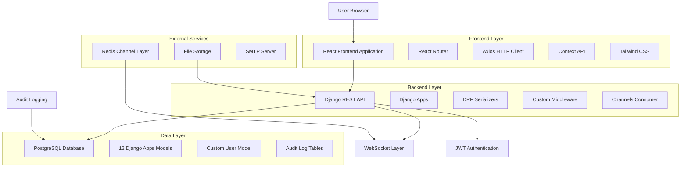
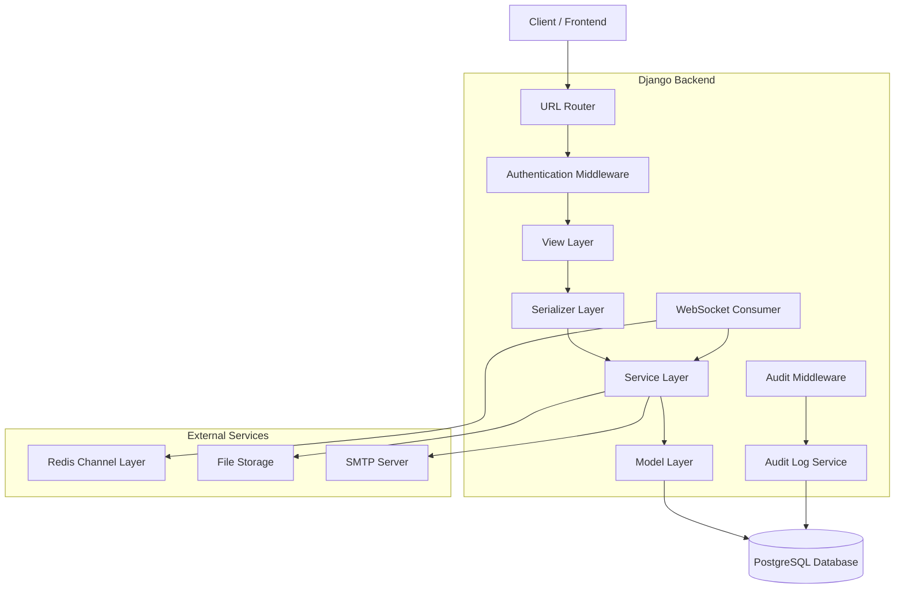
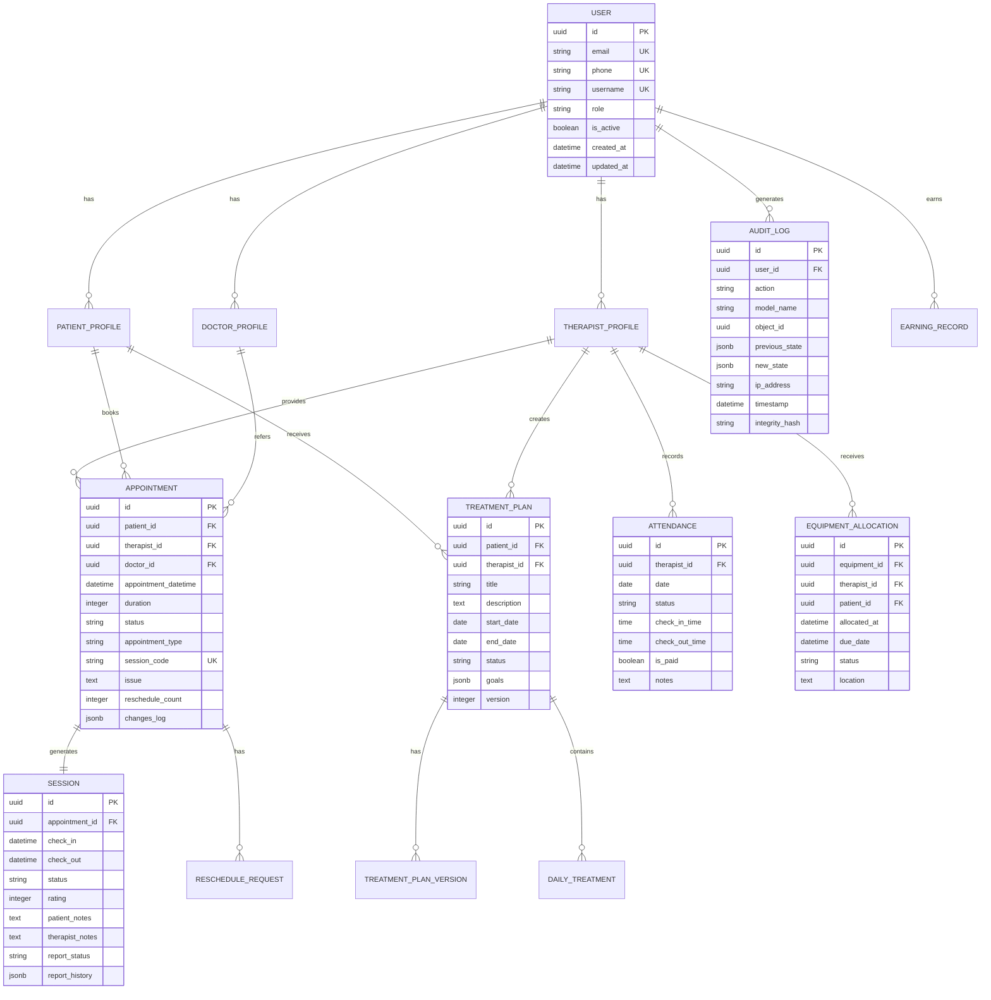

# HealthyPhysio Technical Architecture Document

## 1. Architecture Design



## 2. Technology Description

### Frontend Stack
- **React@19.1.0** - Core frontend framework with hooks and functional components
- **React Router DOM@7.5.0** - Client-side routing with protected routes
- **Tailwind CSS@3.3.3** - Utility-first CSS framework
- **Material-UI@7.0.2** - React component library
- **Axios@1.8.4** - HTTP client with interceptors
- **Chart.js@4.4.9** - Data visualization library
- **React Toastify@11.0.5** - Notification system

### Backend Stack
- **Django@5.1.7** - Web framework with ORM
- **Django REST Framework** - API framework with serializers
- **Django Channels** - WebSocket and async support
- **PostgreSQL** - Primary database with psycopg2-binary adapter
- **Redis** - Channel layer for WebSocket communication
- **JWT Simple** - Token-based authentication

### Development Tools
- **Vite** - Frontend build tool and dev server
- **ESLint** - JavaScript linting
- **Autoprefixer** - CSS vendor prefixing
- **PostCSS** - CSS processing

## 3. Route Definitions

### Frontend Routes

| Route | Purpose | Access Level |
|-------|---------|--------------|
| `/` | Landing page | Public |
| `/login` | User authentication | Public |
| `/register` | User registration | Public |
| `/dashboard` | Role-specific dashboard | Authenticated |
| `/appointments` | Appointment management | Authenticated |
| `/appointments/book` | Book new appointment | Patient/Doctor |
| `/appointments/:id` | Appointment details | Authenticated |
| `/assessments` | Assessment management | Authenticated |
| `/assessments/create` | Create new assessment | Therapist |
| `/equipment` | Equipment overview | Authenticated |
| `/equipment/request` | Request equipment | Therapist |
| `/admin/appointments` | Admin appointment management | Admin Only |
| `/admin/patients` | Patient management | Admin Only |
| `/admin/equipment` | Equipment administration | Admin Only |
| `/admin/attendance` | Attendance monitoring | Admin Only |
| `/admin/therapist-approvals` | Therapist approval workflow | Admin Only |
| `/admin/location-monitoring` | Location tracking | Admin Only |
| `/admin/financial-dashboard` | Financial overview | Admin Only |
| `/admin/treatment-plans` | Treatment plan oversight | Admin Only |
| `/admin/audit-dashboard` | Audit log review | Admin Only |
| `/therapist/dashboard` | Therapist dashboard | Approved Therapist |
| `/therapist/patients` | Therapist patient list | Approved Therapist |
| `/therapist/earnings` | Earnings tracking | Approved Therapist |
| `/therapist/attendance` | Attendance management | Attendance Approved |
| `/therapist/pending-reports` | Pending session reports | Report Approved |
| `/therapist/reports` | Session report management | Report Approved |
| `/therapist/treatment-plans` | Treatment plan management | Treatment Plan Approved |
| `/therapist/pending-approval` | Approval status page | Basic Therapist |
| `/therapist/profile` | Therapist profile management | Basic Therapist |
| `/patient/dashboard` | Patient dashboard | Patient |
| `/doctor/dashboard` | Doctor dashboard | Doctor |

## 4. API Definitions

### 4.1 Authentication APIs

#### User Login
```
POST /api/auth/token/
```

Request:
| Param Name | Param Type | isRequired | Description |
|------------|------------|------------|-------------|
| identifier | string | true | Email, phone, or username |
| password | string | true | User password |

Response:
| Param Name | Param Type | Description |
|------------|------------|-------------|
| access | string | JWT access token |
| refresh | string | JWT refresh token |
| user | object | User profile data |

#### Token Refresh
```
POST /api/auth/token/refresh/
```

Request:
| Param Name | Param Type | isRequired | Description |
|------------|------------|------------|-------------|
| refresh | string | true | JWT refresh token |

Response:
| Param Name | Param Type | Description |
|------------|------------|-------------|
| access | string | New JWT access token |

### 4.2 User Management APIs

#### User Registration
```
POST /api/users/register/
```

Request:
| Param Name | Param Type | isRequired | Description |
|------------|------------|------------|-------------|
| email | string | true | User email address |
| password | string | true | User password |
| first_name | string | true | User first name |
| last_name | string | true | User last name |
| role | string | true | User role (patient/therapist/doctor) |
| phone | string | false | Phone number |

### 4.3 Appointment APIs

#### List Appointments
```
GET /api/scheduling/appointments/
```

Query Parameters:
| Param Name | Param Type | Description |
|------------|------------|-------------|
| status | string | Filter by appointment status |
| date_from | date | Start date filter |
| date_to | date | End date filter |
| therapist | integer | Filter by therapist ID |
| patient | integer | Filter by patient ID |

#### Create Appointment
```
POST /api/scheduling/appointments/
```

Request:
| Param Name | Param Type | isRequired | Description |
|------------|------------|------------|-------------|
| patient | integer | true | Patient ID |
| therapist | integer | true | Therapist ID |
| appointment_datetime | datetime | true | Appointment date and time |
| duration | integer | true | Duration in minutes |
| appointment_type | string | true | Type of appointment |
| issue | string | false | Patient issue description |

### 4.4 Treatment Plan APIs

#### List Treatment Plans
```
GET /api/treatment-plans/
```

#### Create Treatment Plan
```
POST /api/treatment-plans/
```

Request:
| Param Name | Param Type | isRequired | Description |
|------------|------------|------------|-------------|
| patient | integer | true | Patient ID |
| therapist | integer | true | Therapist ID |
| title | string | true | Treatment plan title |
| description | string | true | Plan description |
| start_date | date | true | Plan start date |
| end_date | date | true | Plan end date |
| goals | array | true | Treatment goals |

### 4.5 Session Management APIs

#### Session Check-in
```
POST /api/scheduling/sessions/{id}/check-in/
```

#### Session Check-out
```
POST /api/scheduling/sessions/{id}/check-out/
```

#### Submit Session Report
```
POST /api/scheduling/sessions/{id}/submit-report/
```

Request:
| Param Name | Param Type | isRequired | Description |
|------------|------------|------------|-------------|
| therapist_notes | string | true | Therapist session notes |
| treatment_provided | string | true | Treatment description |
| patient_progress | string | true | Patient progress notes |
| pain_level_before | integer | true | Pain level before treatment |
| pain_level_after | integer | true | Pain level after treatment |
| recommendations | string | false | Recommendations for patient |

## 5. Server Architecture Diagram



## 6. Data Model

### 6.1 Data Model Definition



### 6.2 Data Definition Language

#### User Table
```sql
-- Custom User Model
CREATE TABLE users_user (
    id UUID PRIMARY KEY DEFAULT gen_random_uuid(),
    email VARCHAR(254) UNIQUE,
    phone VARCHAR(15) UNIQUE,
    username VARCHAR(150) UNIQUE,
    first_name VARCHAR(150) NOT NULL,
    last_name VARCHAR(150) NOT NULL,
    role VARCHAR(20) NOT NULL CHECK (role IN ('admin', 'therapist', 'patient', 'doctor')),
    is_active BOOLEAN DEFAULT TRUE,
    is_staff BOOLEAN DEFAULT FALSE,
    is_superuser BOOLEAN DEFAULT FALSE,
    date_joined TIMESTAMP WITH TIME ZONE DEFAULT NOW(),
    last_login TIMESTAMP WITH TIME ZONE,
    password VARCHAR(128) NOT NULL
);

-- Indexes
CREATE INDEX idx_users_user_email ON users_user(email);
CREATE INDEX idx_users_user_phone ON users_user(phone);
CREATE INDEX idx_users_user_role ON users_user(role);
```

#### Therapist Profile Table
```sql
CREATE TABLE users_therapistprofile (
    id UUID PRIMARY KEY DEFAULT gen_random_uuid(),
    user_id UUID UNIQUE REFERENCES users_user(id) ON DELETE CASCADE,
    license_number VARCHAR(50) UNIQUE NOT NULL,
    specialization VARCHAR(100),
    experience_years INTEGER DEFAULT 0,
    qualification TEXT,
    bio TEXT,
    hourly_rate DECIMAL(10,2),
    is_general_approved BOOLEAN DEFAULT FALSE,
    is_attendance_approved BOOLEAN DEFAULT FALSE,
    is_report_approved BOOLEAN DEFAULT FALSE,
    is_treatment_plan_approved BOOLEAN DEFAULT FALSE,
    approval_date TIMESTAMP WITH TIME ZONE,
    created_at TIMESTAMP WITH TIME ZONE DEFAULT NOW(),
    updated_at TIMESTAMP WITH TIME ZONE DEFAULT NOW()
);
```

#### Appointment Table
```sql
CREATE TABLE scheduling_appointment (
    id UUID PRIMARY KEY DEFAULT gen_random_uuid(),
    patient_id UUID REFERENCES users_user(id) ON DELETE CASCADE,
    therapist_id UUID REFERENCES users_user(id) ON DELETE CASCADE,
    doctor_id UUID REFERENCES users_user(id) ON DELETE SET NULL,
    appointment_datetime TIMESTAMP WITH TIME ZONE NOT NULL,
    duration INTEGER NOT NULL DEFAULT 60,
    status VARCHAR(20) DEFAULT 'pending' CHECK (status IN ('pending', 'scheduled', 'completed', 'cancelled', 'rescheduled')),
    appointment_type VARCHAR(50) NOT NULL,
    session_code VARCHAR(20) UNIQUE NOT NULL,
    issue TEXT,
    notes TEXT,
    reschedule_count INTEGER DEFAULT 0,
    changes_log JSONB DEFAULT '[]',
    created_at TIMESTAMP WITH TIME ZONE DEFAULT NOW(),
    updated_at TIMESTAMP WITH TIME ZONE DEFAULT NOW()
);

-- Indexes
CREATE INDEX idx_appointment_patient ON scheduling_appointment(patient_id);
CREATE INDEX idx_appointment_therapist ON scheduling_appointment(therapist_id);
CREATE INDEX idx_appointment_datetime ON scheduling_appointment(appointment_datetime);
CREATE INDEX idx_appointment_status ON scheduling_appointment(status);
CREATE INDEX idx_appointment_session_code ON scheduling_appointment(session_code);
```

#### Session Table
```sql
CREATE TABLE scheduling_session (
    id UUID PRIMARY KEY DEFAULT gen_random_uuid(),
    appointment_id UUID UNIQUE REFERENCES scheduling_appointment(id) ON DELETE CASCADE,
    check_in TIMESTAMP WITH TIME ZONE,
    check_out TIMESTAMP WITH TIME ZONE,
    status VARCHAR(20) DEFAULT 'pending' CHECK (status IN ('pending', 'checkin_initiated', 'approved_checkin', 'missed_approval', 'completed', 'missed')),
    rating INTEGER CHECK (rating >= 1 AND rating <= 5),
    patient_notes TEXT,
    patient_feedback TEXT,
    therapist_notes TEXT,
    treatment_provided TEXT,
    patient_progress TEXT,
    pain_level_before INTEGER CHECK (pain_level_before >= 0 AND pain_level_before <= 10),
    pain_level_after INTEGER CHECK (pain_level_after >= 0 AND pain_level_after <= 10),
    mobility_assessment TEXT,
    recommendations TEXT,
    next_session_goals TEXT,
    report_status VARCHAR(20) DEFAULT 'not_required' CHECK (report_status IN ('not_required', 'pending', 'submitted', 'reviewed', 'flagged')),
    report_history JSONB DEFAULT '[]',
    created_at TIMESTAMP WITH TIME ZONE DEFAULT NOW(),
    updated_at TIMESTAMP WITH TIME ZONE DEFAULT NOW()
);
```

#### Treatment Plan Table
```sql
CREATE TABLE treatment_plans_treatmentplan (
    id UUID PRIMARY KEY DEFAULT gen_random_uuid(),
    patient_id UUID REFERENCES users_user(id) ON DELETE CASCADE,
    therapist_id UUID REFERENCES users_user(id) ON DELETE CASCADE,
    title VARCHAR(200) NOT NULL,
    description TEXT NOT NULL,
    start_date DATE NOT NULL,
    end_date DATE NOT NULL,
    status VARCHAR(20) DEFAULT 'draft' CHECK (status IN ('draft', 'pending_approval', 'approved', 'completed', 'archived')),
    goals JSONB DEFAULT '[]',
    version INTEGER DEFAULT 1,
    approved_by_id UUID REFERENCES users_user(id) ON DELETE SET NULL,
    approved_at TIMESTAMP WITH TIME ZONE,
    created_at TIMESTAMP WITH TIME ZONE DEFAULT NOW(),
    updated_at TIMESTAMP WITH TIME ZONE DEFAULT NOW()
);

-- Indexes
CREATE INDEX idx_treatment_plan_patient ON treatment_plans_treatmentplan(patient_id);
CREATE INDEX idx_treatment_plan_therapist ON treatment_plans_treatmentplan(therapist_id);
CREATE INDEX idx_treatment_plan_status ON treatment_plans_treatmentplan(status);
```

#### Attendance Table
```sql
CREATE TABLE attendance_attendance (
    id UUID PRIMARY KEY DEFAULT gen_random_uuid(),
    therapist_id UUID REFERENCES users_user(id) ON DELETE CASCADE,
    date DATE NOT NULL,
    status VARCHAR(20) NOT NULL CHECK (status IN ('present', 'absent', 'approved_leave', 'sick_leave', 'emergency_leave', 'available')),
    check_in_time TIME,
    check_out_time TIME,
    is_paid BOOLEAN DEFAULT FALSE,
    notes TEXT,
    approved_by_id UUID REFERENCES users_user(id) ON DELETE SET NULL,
    approved_at TIMESTAMP WITH TIME ZONE,
    created_at TIMESTAMP WITH TIME ZONE DEFAULT NOW(),
    updated_at TIMESTAMP WITH TIME ZONE DEFAULT NOW(),
    UNIQUE(therapist_id, date)
);
```

#### Audit Log Table
```sql
CREATE TABLE audit_logs_auditlog (
    id UUID PRIMARY KEY DEFAULT gen_random_uuid(),
    user_id UUID REFERENCES users_user(id) ON DELETE SET NULL,
    action VARCHAR(20) NOT NULL CHECK (action IN ('CREATE', 'UPDATE', 'DELETE', 'LOGIN', 'LOGOUT', 'ACCESS')),
    model_name VARCHAR(100) NOT NULL,
    object_id UUID,
    previous_state JSONB,
    new_state JSONB,
    ip_address INET,
    user_agent TEXT,
    timestamp TIMESTAMP WITH TIME ZONE DEFAULT NOW(),
    integrity_hash VARCHAR(64) NOT NULL
);

-- Indexes
CREATE INDEX idx_audit_log_user ON audit_logs_auditlog(user_id);
CREATE INDEX idx_audit_log_timestamp ON audit_logs_auditlog(timestamp DESC);
CREATE INDEX idx_audit_log_action ON audit_logs_auditlog(action);
CREATE INDEX idx_audit_log_model ON audit_logs_auditlog(model_name);
```

#### Equipment Table
```sql
CREATE TABLE equipment_equipment (
    id UUID PRIMARY KEY DEFAULT gen_random_uuid(),
    name VARCHAR(200) NOT NULL,
    category_id UUID REFERENCES equipment_category(id) ON DELETE CASCADE,
    description TEXT,
    serial_number VARCHAR(100) UNIQUE,
    purchase_date DATE,
    price DECIMAL(10,2),
    is_available BOOLEAN DEFAULT TRUE,
    quantity INTEGER DEFAULT 1,
    location VARCHAR(200),
    maintenance_schedule TEXT,
    created_at TIMESTAMP WITH TIME ZONE DEFAULT NOW(),
    updated_at TIMESTAMP WITH TIME ZONE DEFAULT NOW()
);
```

#### Initial Data
```sql
-- Insert default admin user
INSERT INTO users_user (email, username, first_name, last_name, role, is_staff, is_superuser, password)
VALUES ('admin@healthyphysio.com', 'admin', 'System', 'Administrator', 'admin', TRUE, TRUE, 'pbkdf2_sha256$...');

-- Insert sample equipment categories
INSERT INTO equipment_category (name, description)
VALUES 
    ('Therapy Equipment', 'Equipment used for physiotherapy treatments'),
    ('Exercise Equipment', 'Equipment for patient exercises'),
    ('Diagnostic Equipment', 'Equipment for patient assessment');

-- Insert sample interventions
INSERT INTO treatment_plans_intervention (name, description, category, duration_minutes)
VALUES 
    ('Manual Therapy', 'Hands-on treatment techniques', 'manual', 30),
    ('Exercise Therapy', 'Therapeutic exercises', 'exercise', 45),
    ('Electrotherapy', 'Electrical stimulation therapy', 'electrotherapy', 20);
```

## 7. WebSocket Architecture

### Channel Layer Configuration
```python
CHANNEL_LAYERS = {
    'default': {
        'BACKEND': 'channels_redis.core.RedisChannelLayer',
        'CONFIG': {
            "hosts": [('127.0.0.1', 6379)],
        },
    },
}
```

### WebSocket Consumers
- **NotificationConsumer**: Real-time notifications
- **LocationConsumer**: Therapist location tracking
- **SessionConsumer**: Live session updates

## 8. Security Configuration

### JWT Settings
```python
SIMPLE_JWT = {
    'ACCESS_TOKEN_LIFETIME': timedelta(hours=1),
    'REFRESH_TOKEN_LIFETIME': timedelta(days=7),
    'ROTATE_REFRESH_TOKENS': False,
    'BLACKLIST_AFTER_ROTATION': True,
    'ALGORITHM': 'HS256',
    'AUTH_HEADER_TYPES': ('Bearer',),
}
```

### CORS Configuration
```python
CORS_ALLOWED_ORIGINS = [
    "http://localhost:3000",
    "http://127.0.0.1:3000",
]
CORS_ALLOW_CREDENTIALS = True
```

This technical architecture provides the foundation for understanding and maintaining the HealthyPhysio system, with detailed specifications for all major components and their interactions.